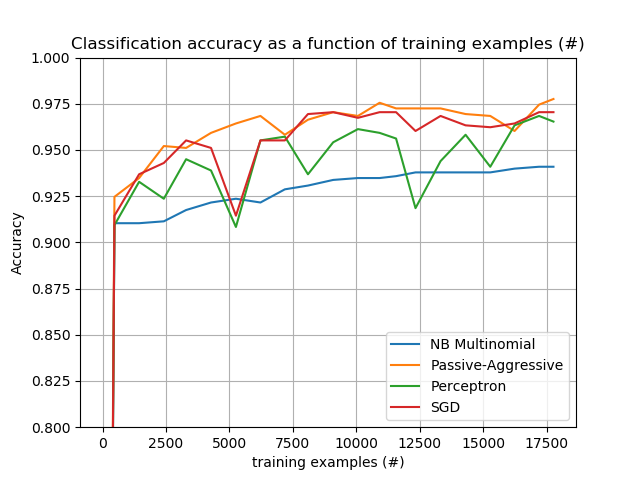
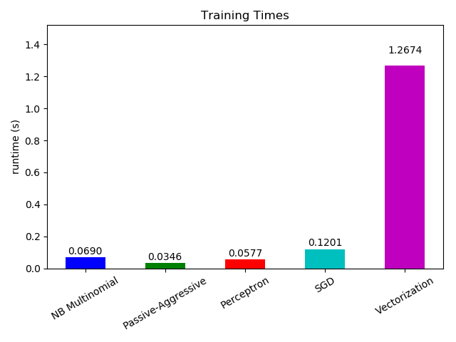
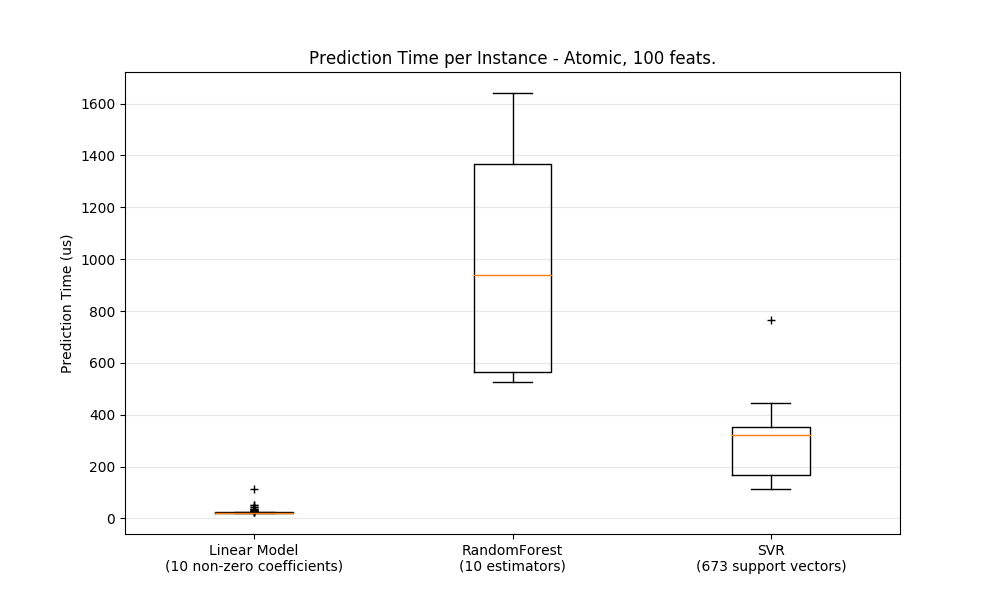
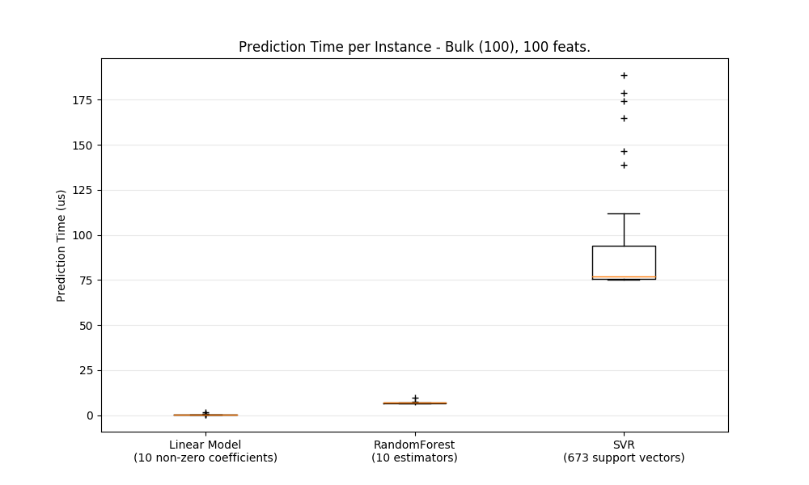
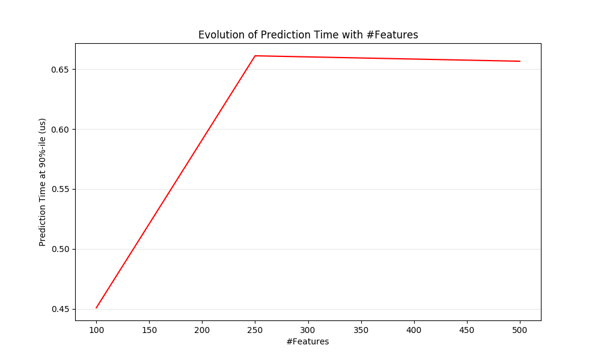
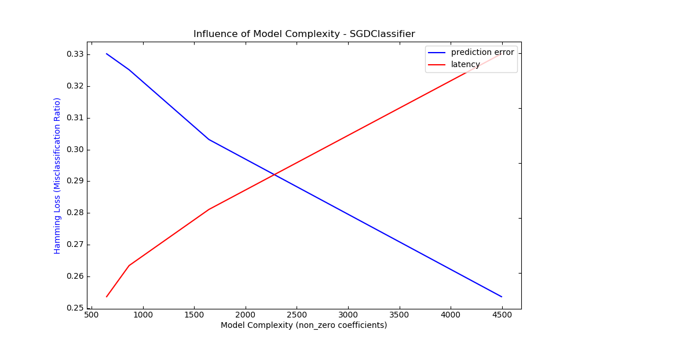
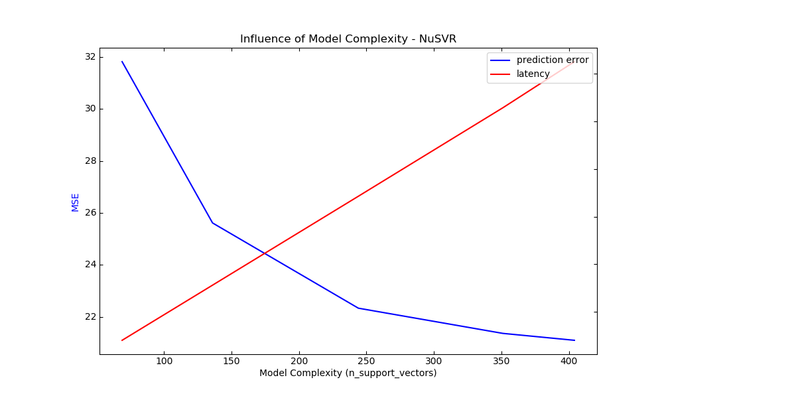
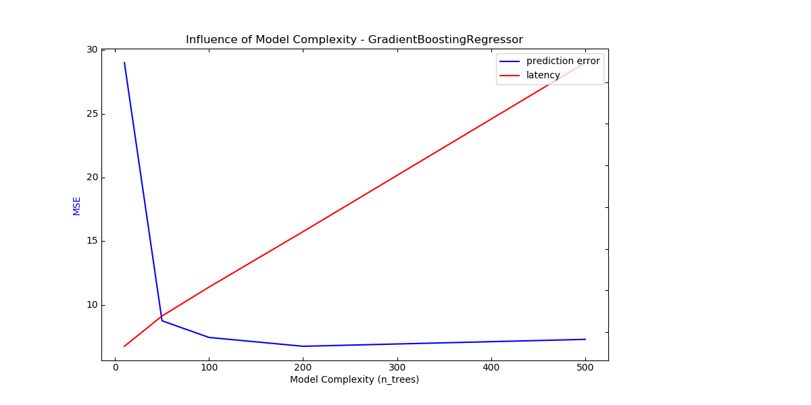
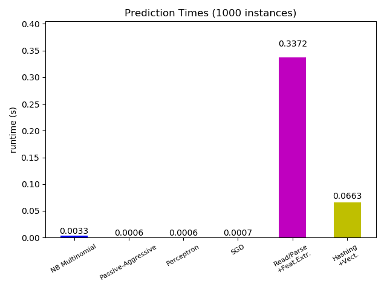
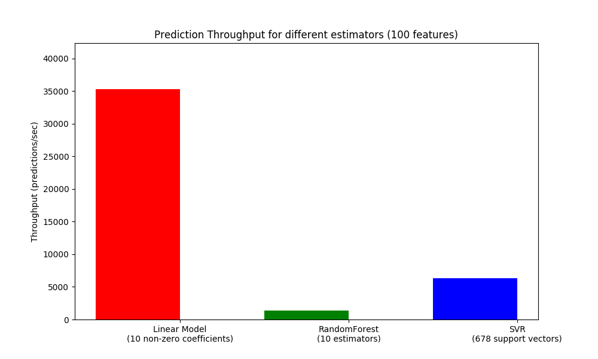

# 7. 使用scikit-learn计算

## 7.1. 大规模计算的策略: 更大量的数据

校验者:
        [@文谊](https://github.com/apachecn/scikit-learn-doc-zh)
翻译者:
        [@ゞFingヤ](https://github.com/apachecn/scikit-learn-doc-zh)

对于一些应用程序，需要被处理的样本数量,特征数量（或两者）和/或速度这些对传统的方法而言非常具有挑战性。在这些情况下，scikit-learn 有许多你值得考虑的选项可以使你的系统规模化。

### 7.1.1. 使用外核学习实例进行拓展

外核（或者称作 “外部存储器”）学习是一种用于学习那些无法装进计算机主存储（RAM）的数据的技术。

这里描述了一种为了实现这一目的而设计的系统：

1.  一种用流来传输实例的方式
2.  一种从实例中提取特征的方法
3.  增量式算法

#### 7.1.1.1. 流式实例

基本上， 1. 可能是从硬盘、数据库、网络流等文件中产生实例的读取器。然而，关于如何实现的相关细节已经超出了本文档的讨论范围。

#### 7.1.1.2. 提取特征

2. 可以是 scikit-learn 支持的的不同 *特征提取 &lt;feature_extraction&gt;* 方法中的任何相关的方法。然而，当处理那些需要矢量化并且特征或值的集合你预先不知道的时候，就得明确注意了。一个好的示例是文本分类，其中在训练的期间你很可能会发现未知的项。从应用的角度上来看，如果在数据上进行多次通过是合理的，则可以使用有状态的向量化器。否则，可以通过使用无状态特征提取器来提高难度。目前，这样做的首选方法是使用所谓的 [哈希技巧](feature_extraction.html#feature-hashing)，在 [`sklearn.feature_extraction.FeatureHasher`](https://scikit-learn.org/stable/modules/generated/sklearn.feature_extraction.FeatureHasher.html#sklearn.feature_extraction.FeatureHasher "sklearn.feature_extraction.FeatureHasher") 中，其中有分类变量的表示为 Python 列表或 [`sklearn.feature_extraction.text.HashingVectorizer`](https://scikit-learn.org/stable/modules/generated/sklearn.feature_extraction.text.HashingVectorizer.html#sklearn.feature_extraction.text.HashingVectorizer "sklearn.feature_extraction.text.HashingVectorizer") 文本文档。

#### 7.1.1.3. 增量学习

最后，对于3. 我们在 scikit-learn 之中有许多选择。虽软不是所有的算法都能够增量学习（即不能一次性看到所有的实例），所有实 `partial_fit` 的 API 估计器都作为了候选。实际上，从小批量的实例（有时称为“在线学习”）逐渐学习的能力是外核学习的关键，因为它保证在任何给定的时间内只有少量的实例在主存储中，选择适合小批量的尺寸来平衡相关性和内存占用可能涉及一些调整 [[1]](#id9)。

以下是针对不同任务的增量估算器列表：
* Classification（分类）
  *   [`sklearn.naive_bayes.MultinomialNB`](https://scikit-learn.org/stable/modules/generated/sklearn.naive_bayes.MultinomialNB.html#sklearn.naive_bayes.MultinomialNB "sklearn.naive_bayes.MultinomialNB")
  *   [`sklearn.naive_bayes.BernoulliNB`](https://scikit-learn.org/stable/modules/generated/sklearn.naive_bayes.BernoulliNB.html#sklearn.naive_bayes.BernoulliNB "sklearn.naive_bayes.BernoulliNB")
  *  [`sklearn.linear_model.Perceptron`](https://scikit-learn.org/stable/modules/generated/sklearn.linear_model.Perceptron.html#sklearn.linear_model.Perceptron "sklearn.linear_model.Perceptron")
  *   [`sklearn.linear_model.SGDClassifier`](https://scikit-learn.org/stable/modules/generated/sklearn.linear_model.SGDClassifier.html#sklearn.linear_model.SGDClassifier "sklearn.linear_model.SGDClassifier")
  *   [`sklearn.linear_model.PassiveAggressiveClassifier`](https://scikit-learn.org/stable/modules/generated/sklearn.linear_model.PassiveAggressiveClassifier.html#sklearn.linear_model.PassiveAggressiveClassifier "sklearn.linear_model.PassiveAggressiveClassifier")
  *   [`sklearn.neural_network.MLPClassifier`](https://scikit-learn.org/stable/modules/generated/sklearn.neural_network.MLPClassifier.html#sklearn.neural_network.MLPClassifier "sklearn.neural_network.MLPClassifier")

* Regression（回归）
  *   [`sklearn.linear_model.SGDRegressor`](https://scikit-learn.org/stable/modules/generated/sklearn.linear_model.SGDRegressor.html#sklearn.linear_model.SGDRegressor "sklearn.linear_model.SGDRegressor")
  *   [`sklearn.linear_model.PassiveAggressiveRegressor`](https://scikit-learn.org/stable/modules/generated/sklearn.linear_model.PassiveAggressiveRegressor.html#sklearn.linear_model.PassiveAggressiveRegressor "sklearn.linear_model.PassiveAggressiveRegressor")
  *   [`sklearn.neural_network.MLPRegressor`](https://scikit-learn.org/stable/modules/generated/sklearn.neural_network.MLPRegressor.html#sklearn.neural_network.MLPRegressor "sklearn.neural_network.MLPRegressor")
* Clustering（聚类）
  *   [`sklearn.cluster.MiniBatchKMeans`](https://scikit-learn.org/stable/modules/generated/sklearn.cluster.MiniBatchKMeans.html#sklearn.cluster.MiniBatchKMeans "sklearn.cluster.MiniBatchKMeans")
  *   [`sklearn.cluster.Birch`](https://scikit-learn.org/stable/modules/generated/sklearn.cluster.Birch.html#sklearn.cluster.Birch "sklearn.cluster.Birch")

* Decomposition / feature Extraction（分解/特征提取）

  *   [`sklearn.decomposition.MiniBatchDictionaryLearning`](https://scikit-learn.org/stable/modules/generated/sklearn.decomposition.MiniBatchDictionaryLearning.html#sklearn.decomposition.MiniBatchDictionaryLearning "sklearn.decomposition.MiniBatchDictionaryLearning")
  *   [`sklearn.decomposition.IncrementalPCA`](https://scikit-learn.org/stable/modules/generated/sklearn.decomposition.IncrementalPCA.html#sklearn.decomposition.IncrementalPCA "sklearn.decomposition.IncrementalPCA")
  *   [`sklearn.decomposition.LatentDirichletAllocation`](https://scikit-learn.org/stable/modules/generated/sklearn.decomposition.LatentDirichletAllocation.html#sklearn.decomposition.LatentDirichletAllocation "sklearn.decomposition.LatentDirichletAllocation")
* Preprocessing（预处理）  
  *   [`sklearn.preprocessing.StandardScaler`](https://scikit-learn.org/stable/modules/generated/sklearn.preprocessing.StandardScaler.html#sklearn.preprocessing.StandardScaler "sklearn.preprocessing.StandardScaler")
  *   [`sklearn.preprocessing.MinMaxScaler`](https://scikit-learn.org/stable/modules/generated/sklearn.preprocessing.MinMaxScaler.html#sklearn.preprocessing.MinMaxScaler "sklearn.preprocessing.MinMaxScaler")
  *   [`sklearn.preprocessing.MaxAbsScaler`](https://scikit-learn.org/stable/modules/generated/sklearn.preprocessing.MaxAbsScaler.html#sklearn.preprocessing.MaxAbsScaler "sklearn.preprocessing.MaxAbsScaler")

对于分类，有一点要注意的是，虽然无状态特征提取程序可能能够应对新的/未知的属性，但增量学习者本身可能无法应对新的/未知的目标类。在这种情况下，你必须使用 `classes=` 参数将所有可能的类传递给第一个 `partial_fit` 调用。

选择合适的算法时要考虑的另一个方面是，所有这些算法随着时间的推移不会给每个样例相同的重要性。比如说， `Perceptron` 仍然对错误标签的示例是敏感的，即使经过多次的样例训练，而 `SGD*` 和 `PassiveAggressive*` 族对这些鲁棒性更好。相反，对于后面传入的数据流,算法的学习速率随着时间不断降低,后面两个算法对于那些显著差异的样本和标注正确的样本倾向于给予很少的重视。

#### 7.1.1.4. 示例

最后，我们有一个完整的 [Out-of-core classification of text documents](https://scikit-learn.org/stable/auto_examples/applications/plot_out_of_core_classification.html#sphx-glr-auto-examples-applications-plot-out-of-core-classification-py) 文本文档的核心分类的示例。旨在为想要构建核心学习系统的人们提供一个起点，并展示上述大多数概念。

此外，它还展现了不同算法性能随着处理示例的数量的演变。

**[](https://scikit-learn.org/stable/auto_examples/applications/plot_out_of_core_classification.html)**

现在我们来看不同部分的计算时间，我们看到矢量化的过程比学习本身耗时还多。对于不同的算法，MultinomialNB 是耗时最多的，但通过增加其 mini-batches 的大小可以减轻开销。（练习：minibatch_size 在程序中更改为100和10000，并进行比较）。

**[](https://scikit-learn.org/stable/auto_examples/applications/plot_out_of_core_classification.html)**

#### 7.1.1.5. 注释

[1] 根据算法，mini-batch 大小可以影响结果。SGD*，PassiveAggressive* 和离散的 NaiveBayes 是真正在线的，不受 batch 大小的影响。相反，MiniBatchKMeans 收敛速度受 batch 大小影响。此外，其内存占用可能会随 batch 大小而显着变化。 |

## 7.2. 计算性能

校验者:
        [@曲晓峰](https://github.com/apachecn/scikit-learn-doc-zh)
        [@小瑶](https://github.com/apachecn/scikit-learn-doc-zh)
翻译者:
        [@小瑶](https://github.com/apachecn/scikit-learn-doc-zh)

对于某些 applications （应用），estimators（估计器）的性能（主要是 prediction time （预测时间）的 latency （延迟）和 throughput （吞吐量））至关重要。考虑 training throughput （训练吞吐量）也可能是有意义的，但是在 production setup （生产设置）（通常在脱机中运行）通常是不太重要的。

我们将在这里审查您可以从不同上下文中的一些 scikit-learn estimators（估计器）预期的数量级，并提供一些 overcoming performance bottlenecks （解决性能瓶颈）的技巧和诀窍。

将 Prediction latency （预测延迟）作为进行预测所需的 elapsed time （经过时间）（例如，以 micro-seconds（微秒）为单位）进行测量。Latency （延迟）通常被认为一种分布，运营工程师通常将注意力集中在该分布的给定 percentile （百分位数）（例如 90 百分位数）上的延迟。

Prediction throughput （预测吞吐量）被定义为软件可以在给定的时间量内（例如每秒的预测）中 the number of predictions （可预测的预测数）。

performance optimization （性能优化）的一个重要方面也是它可能会损害 prediction accuracy （预测精度）。 实际上，更简单的模型（例如 linear （线性的），而不是 non-linear （非线性的），或者具有较少的参数）通常运行得更快，但并不总是能够考虑与更复杂的数据相同的确切属性。

### 7.2.1. 预测延迟

在使用/选择机器学习工具包时可能遇到的最直接的问题之一是生产环境中可以进行预测的 latency （延迟）。

影响 prediction latency （预测延迟）的主要因素是

1.  Number of features（特征的数量）
2.  Input data representation and sparsity（输入数据的表示和稀疏性）
3.  Model complexity（模型复杂性）
4.  Feature extraction（特征提取）

最后一个主要参数也是在 bulk or one-at-a-time mode （批量或执行一次的时间模式）下进行预测的可能性。

#### 7.2.1.1. 批量与原子模式

通常，通过大量原因（branching predictability（分支可预测性）, CPU cache（CPU缓存）, linear algebra libraries optimizations（线性代数库优化）等），predictions in bulk（批量进行预测）（同时许多情况）更有效。 在这里，我们看到一些具有很少功能的设置，独立于估计器选择，bulk mode（批量模式）总是更快，而对于其中的一些，它们的数量大约是 1 到 2 个数量级:

**[](https://scikit-learn.org/stable/auto_examples/applications/plot_prediction_latency.html)**

**[](https://scikit-learn.org/stable/auto_examples/applications/plot_prediction_latency.html)**

为了对您的示例的不同的 estimators 进行基准测试，您可以在此示例中简单地更改 `n_features` 参数: [Prediction Latency](https://scikit-learn.org/stable/auto_examples/applications/plot_prediction_latency.html#sphx-glr-auto-examples-applications-plot-prediction-latency-py). 这应该给你估计 prediction latency （预测延迟）的数量级。

#### 7.2.1.2. 配置 Scikit-learn 来减少验证开销

Scikit-learn 对数据进行了一些验证，从而增加了对 `predict（预测）` 和类似函数的调用开销。特别地，检查这些 features （特征）是有限的（不是 NaN 或无限）涉及对数据的完全传递。如果您确定你的数据是 acceptable （可接受的），您可以通过在导入 scikit-learn 之前将环境变量配置 `SKLEARN_ASSUME_FINITE` 设置为 non-empty string （非空字符串）来抑制检查有限性，或者使用以下方式在 Python 中配置 [`sklearn.set_config`](https://scikit-learn.org/stable/modules/generated/sklearn.set_config.html#sklearn.set_config "sklearn.set_config") 。为了比这些全局设置更多的控制 `config_context` 允许您在指定的上下文中设置此配置:

```py
>>> import sklearn
>>> with sklearn.config_context(assume_finite=True):
...    pass  # do learning/prediction here with reduced validation

```

注意，这将影响上下文中的 [`sklearn.utils.assert_all_finite`](https://scikit-learn.org/stable/modules/generated/sklearn.utils.assert_all_finite.html#sklearn.utils.assert_all_finite "sklearn.utils.assert_all_finite") 的所有用途。

#### 7.2.1.3. 特征数量的影响

显然，当特征数量增加时，每个示例的内存消耗量也会增加。实际上，对于具有  个特征的  个实例的矩阵，空间复杂度在  。从 computing （计算）角度来看，这也意味着 the number of basic operations （基本操作的数量）（例如，线性模型中向量矩阵乘积的乘法）也增加。以下是 prediction latency (预测延迟)与 number of features(特征数) 的变化图:

**[](https://scikit-learn.org/stable/auto_examples/applications/plot_prediction_latency.html)**

总的来说，您可以预期 prediction time （预测时间）至少随 number of features （特征数量）线性增加（非线性情况可能会发生，取决于 global memory footprint （全局内存占用）和 estimator （估计））。

#### 7.2.1.4. 输入数据表示的影响

Scipy 提供对 storing sparse data（存储稀疏数据）进行优化的 sparse matrix （稀疏矩阵）数据结构。sparse formats（稀疏格式）的主要特点是您不会存储零，所以如果您的数据稀疏，那么您使用的内存会更少。sparse（稀疏） ([CSR or CSC](http://docs.scipy.org/doc/scipy/reference/sparse.html)) 表示中的非零值将仅占用一个 32 位整数位置 + 64 位 floating point （浮点值） + 矩阵中每行或列的额外的 32 位。在 dense（密集） (or sparse（稀疏）) 线性模型上使用稀疏输入可以加速预测，只有非零值特征才会影响点积，从而影响模型预测。因此，如果在 1e6 维空间中有 100 个非零，则只需要 100 次乘法和加法运算而不是 1e6 。

然而，密度表示的计算可以利用 BLAS 中高度优化的向量操作和多线程，并且往往导致更少的 CPU 高速缓存 misses 。因此，sparse input （稀疏输入）表示的 sparsity （稀疏度）通常应相当高（10% 非零最大值，要根据硬件进行检查）比在具有多个 CPU 和优化 BLAS 实现的机器上的 dense input （密集输入）表示更快。

以下是测试输入 sparsity （稀疏度）的示例代码:

```py
def sparsity_ratio(X):
    return 1.0 - np.count_nonzero(X) / float(X.shape[0] * X.shape[1])
print("input sparsity ratio:", sparsity_ratio(X))

```

根据经验，您可以考虑如果 sparsity ratio （稀疏比）大于 90% , 您可能会从 sparse formats （稀疏格式）中受益。有关如何构建（或将数据转换为） sparse matrix formats （稀疏矩阵格式）的更多信息，请参阅 Scipy 的稀疏矩阵格式文档 [documentation](http://docs.scipy.org/doc/scipy/reference/sparse.html) 。大多数的时候, `CSR` 和 `CSC` 格式是最有效的。

#### 7.2.1.5. 模型复杂度的影响

一般来说，当 model complexity （模型复杂度）增加时，predictive power （预测能力）和 latency （延迟）应该会增加。增加 predictive power （预测能力）通常很有意思，但对于许多应用，我们最好不要太多地增加预测延迟。我们现在将对不同 families 的 supervised models （监督模式）进行审查。

对于 [`sklearn.linear_model`](classes.html#module-sklearn.linear_model "sklearn.linear_model") (例如 Lasso, ElasticNet, SGDClassifier/Regressor, Ridge & RidgeClassifier, PassiveAgressiveClassifier/Regressor, LinearSVC, LogisticRegression…) 在预测时间应用的 decision function （决策函数）是一样的（dot product（ 点积）），所以 latency （延迟）应该是等效的。

这里有一个示例使用 `sklearn.linear_model.stochastic_gradient.SGDClassifier` 和 `elasticnet` penalty（惩罚）。 regularization strength（正则化强度）由 `alpha` 参数全局控制。有一个足够高的 `alpha` ，可以增加 `elasticnet` 的 `l1_ratio` 参数，以在模型参数中执行各种稀疏程度。这里的 Higher sparsity （较高稀疏度）被解释为 less model complexity （较少的模型复杂度），因为我们需要较少的系数充分描述它。当然， sparsity （稀疏性）会随着稀疏点积 产生时间大致与非零系数的数目成比例地影响 prediction time （预测时间）。

[](https://scikit-learn.org/stable/auto_examples/applications/plot_model_complexity_influence.html)

对于具有 non-linear kernel （非线性内核）的 [`sklearn.svm`](classes.html#module-sklearn.svm "sklearn.svm") 算法系列，latency （延迟）与 support vectors （支持向量）的数量有关（越少越快）。 随着 SVC 或 SVR 模型中的支持向量的数量， Latency （延迟）和 throughput （吞吐量）应该渐渐地增长。kernel （内核）也将影响 latency （延迟），因为它用于计算每个 support vector （支持向量）一次 input vector（输入向量）的 projection （投影）。在下面的图中， `sklearn.svm.classes.NuSVR` 的 `nu` 参数用于影响 number of support vectors（支持向量的数量）。

[](https://scikit-learn.org/stable/auto_examples/applications/plot_model_complexity_influence.html)

对于 [`sklearn.ensemble`](12#111-集成方法) 的 trees （例如 RandomForest, GBT, ExtraTrees 等） number of trees （树的数量）及其 depth（深度）发挥着最重要的作用。Latency and throughput（延迟和吞吐量）应与树的数量呈线性关系。在这种情况下，我们直接使用 `sklearn.ensemble.gradient_boosting.GradientBoostingRegressor` 的 `n_estimators` 参数。

**[](https://scikit-learn.org/stable/auto_examples/applications/plot_model_complexity_influence.html)**

在任何情况下都应该警告，降低的 model complexity （模型复杂性）可能会损害如上所述的准确性。例如，可以用快速线性模型来处理 non-linearly separable problem （非线性可分离问题），但是在该过程中预测能力将很可能受到影响。

#### 7.2.1.6. 特征提取延迟

大多数 scikit-learn 模型通常非常快，因为它们可以通过编译的 Cython 扩展或优化的计算库来实现。 另一方面，在许多现实世界的应用中，feature extraction process（特征提取过程）（即，将 database rows or network packets （数据库行或网络分组）的原始数据转换为 numpy arrays ）来控制总体预测时间。例如在 Reuters text classification task（路透社文本分类任务）中，根据所选择的模型，整个准备（读取和解析 SGML 文件，将文本进行标记并将其散列为公共向量空间）的时间比实际预测代码的时间长 100 到 500 倍。

**[](https://scikit-learn.org/stable/auto_examples/applications/plot_out_of_core_classification.html)**

因此，在很多情况下，建议您仔细地对 carefully time and profile your feature extraction code ( 特征提取代码进行时间预估和简档)，因为当您的 overall latency （整体延迟）对您的应用程序来说太慢时，可能是开始优化的好地方。

### 7.2.2. 预测吞吐量

考虑到生产系统大小的另一个重要指标是 throughput （吞吐量），即在一定时间内可以做出的预测数量。以下是 [Prediction Latency](https://scikit-learn.org/stable/auto_examples/applications/plot_prediction_latency.html#sphx-glr-auto-examples-applications-plot-prediction-latency-py) 示例的基准测试，该示例针对合成数据的多个 estimators （估计器）测量此数量:

**[](https://scikit-learn.org/stable/auto_examples/applications/plot_prediction_latency.html)**

这些 throughputs（吞吐量）早单个进程上实现。提高应用程序吞吐量的一个明显的方法是产生其他实例（通常是 Python 中的进程，因为 [GIL](https://wiki.python.org/moin/GlobalInterpreterLock) ）共享相同模型。还可能添加机器来分布式负载。关于如何实现这一点的详细解释超出了本文档的范围。

### 7.2.3. 技巧和窍门

#### 7.2.3.1. 线性代数库

由于 scikit-learn 在很大程度上依赖于 Numpy/Scipy 和 线性代数，所以需要理解这些库的版本。 基本上，你应该确保使用优化的 [BLAS](https://en.wikipedia.org/wiki/Basic_Linear_Algebra_Subprograms) / [LAPACK](https://en.wikipedia.org/wiki/LAPACK) 构建 Numpy 库。

并非所有的模型都受益于优化的 BLAS 和 Lapack 实现。例如，基于（随机化）决策树的模型通常不依赖于内部循环中的 BLAS 调用，kernel SVMs (`SVC`, `SVR`, `NuSVC`, `NuSVR`) 。另一方面，使用 BLAS DGEMM 调用（通过 `numpy.dot`）实现的线性模型通常将受益于调整的 BLAS 实现，并且导致非优化 BLAS 的数量级加速。

你可以使用以下命令显示您的 NumPy / SciPy / scikit-learn 安装使用的 BLAS / LAPACK 实现:

```py
from numpy.distutils.system_info import get_info
print(get_info('blas_opt'))
print(get_info('lapack_opt'))

```


Optimized(优化的) BLAS / LAPACK 实现包括:

*   Atlas (需要通过在目标机器上 rebuilding 进行硬件特定调整)
*   OpenBLAS
*   MKL
*   Apple Accelerate 和 vecLib frameworks (仅适用于 OSX)

有关更多信息，请参见 [Scipy install page](http://docs.scipy.org/doc/numpy/user/install.html) 并在来自 Daniel Nouri 的博客 [blog post](http://danielnouri.org/notes/2012/12/19/libblas-and-liblapack-issues-and-speed,-with-scipy-and-ubuntu/) 它为 Debain / Ubuntu 提供了一些很好的一步一步的安装说明。

#### 7.2.3.2. 限制工作内存
在使用标准numpy向量化操作实现某些计算时，需要使用大量的临时内存。这可能会耗尽系统内存。在可以以固定内存块执行计算的地方，我们尝试这样做，并允许用户使用[`sklearn.set_config`](https://scikit-learn.org/stable/modules/generated/sklearn.set_config.html#sklearn.set_config)或`config_context`提示该工作内存的最大大小(默认为1GB)。以下建议将临时工作记忆限制在128mib:

```py
>>> import sklearn
>>> with sklearn.config_context(working_memory=128):
...     pass  # do chunked work here
```
遵循此设置的块操作的一个示例是metric.pairwise_distances_chunked，用于计算成对距离矩阵的行压缩。

#### 7.2.3.3. 模型压缩

scikit-learn 中的 Model compression （模型压缩）只关注 linear models （线性模型）。 在这种情况下，这意味着我们要控制模型 sparsity （稀疏度）（即 模型向量中的非零坐标数）。将 model sparsity （模型稀疏度）与 sparse input data representation （稀疏输入数据表示）相结合是一个好主意。

以下是示例代码，说明了如何使用 `sparsify()` 方法:

```py
clf = SGDRegressor(penalty='elasticnet', l1_ratio=0.25)
clf.fit(X_train, y_train).sparsify()
clf.predict(X_test)

```

在这个示例中，我们更喜欢 `elasticnet` penalty（惩罚），因为它通常是 model compactness（模型紧凑性）和 prediction power （预测能力）之间的一个很好的妥协。还可以进一步调整 `l1_ratio` 参数（结合正则化强度 `alpha` ）来控制这个权衡。

对于 synthetic data （合成数据），典型的 [benchmark](https://github.com/scikit-learn/scikit-learn/blob/master/benchmarks/bench_sparsify.py) 在模型和输入时都会降低 30% 的延迟。稀疏（分别为 0.000024 和 0.027400 非零系数比）。您的里程可能会因您的数据和模型的稀疏性和大小而有所不同。 因此，为了减少部署在生产服务器上的预测模型的内存使用，扩展可能非常有用。

#### 7.2.3.4. 模型重塑

Model reshaping（模型重塑）在于仅选择一部分可用功能以适应模型。换句话说，如果模型在学习阶段 discards features （丢弃特征），我们可以从输入中删除这些特征。这有几个好处。首先，它减少了模型本身的内存（因此是减少了时间）的开销。一旦知道要从上一次运行中保留哪些功能，它也允许在 pipeline 中 discard explicit feature selection components （丢弃显式的特征选择组件）。最后，它可以通过不收集和构建模型丢弃的特征来帮助减少数据访问和 feature extraction layers （特征提取层）upstream （上游）的处理时间和 I/O 的使用。例如，如果原始数据来自数据库，则可以通过使查询返回较轻的记录，从而可以编写更简单和更快速的查询或减少 I/O 的使用。 目前，reshaping（重塑）需要在 scikit-learn 中手动执行。 在 sparse input（稀疏输入）（特别是 `CSR` 格式）的情况下，通常不能生成相关的特征，使其列为空。

#### 7.2.3.5. 链接

> *   [scikit-learn developer performance documentation](../developers/performance.html)
> *   [Scipy sparse matrix formats documentation](http://docs.scipy.org/doc/scipy/reference/sparse.html)

## 7.3. 并行性、资源管理和配置
### 7.3.1. 并行和分布式计算
Scikit-learn使用[joblib](https://joblib.readthedocs.io/en/latest/)库在其估计器中支持并行计算。有关控制并行计算的开关，请参阅joblib文档。

注意，在默认情况下，scikit-learn使用其嵌入式(vendored)版本的joblib。使用配置开关(下面有文档说明)控制这种行为。
### 7.3.2. 配置开关
#### 7.3.2.1 Python运行
[sklearn.set_config](https://scikit-learn.org/stable/modules/generated/sklearn.set_config.html#sklearn.set_config) 控制以下行为:

|行为|描述|
|---|---|
|assume_finite|用于跳过验证，这可以加快计算速度，但如果数据包含nan，则可能导致分割错误|
|working_memory|一些算法使用的临时数组的最优大小|

#### 7.3.2.2 环境变量
在导入scikit-learn之前，应该设置这些环境变量。

|环境变量|描述|
|---|---|
|SKLEARN_SITE_JOBLIB|当这个环境变量被设置为非零值时，scikit-learn使用`site joblib`，而不是它的vendored版本。因此，必须安装joblib让scikit-learn运行。注意，使用joblib网站的风险由您自己承担:scikit-learn和joblib的版本需要兼容。目前，支持joblib 0.11+。此外，`joblib.Memory`的dumps方法可能不兼容，您可能会丢失一些缓存，必须重新下载一些数据集。 **从0.21版本开始不推荐使用**:从0.21版本开始，这个参数就没有作用了，vendored joblib被移除了，而始终使用site joblib。|
|SKLEARN_ASSUME_FINITE|设置`sklearn.set_config`的`assume_limited`参数默认值|
|SKLEARN_WORKING_MEMORY|设置`sklearn.set_config`的`working_memory `参数默认值|
|SKLEARN_SEED|在运行测试时设置全局随机生成器的种子，以保证重现性|
|SKLEARN_SKIP_NETWORK_TESTS|当将该环境变量设置为非零值时，将跳过需要网络访问的测试|
